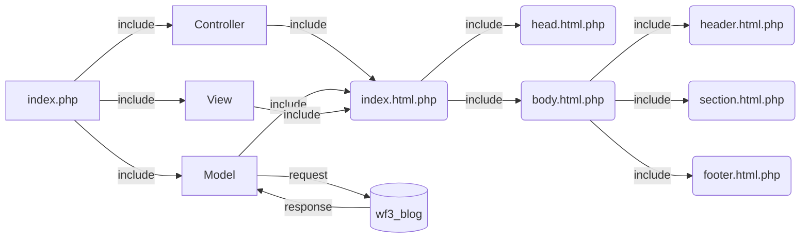

#  Objectif

Designer plusieurs projet en MVC

# Structure of the project 

|*MODEL* | *VIEW* | *CONTROLLER* |
|---|---|---|
| get_wf3_blog.php | index.html.php | data.php |

# Files flow

```mermaid
graph LR
A[index.php] -- include --> C[Model]
A[index.php] -- include --> D[View]
A[index.php] -- include --> B[Controller]
B[Controller] -- include --> E(data.php)
C[Model] -- include --> E(get_wf3_blog.php)
C[Model] -- request --> K[(wf3_blog)]
K[(wf3_blog)] -- response --> C[Model]
D[View] -- include --> E(index.html.php)
E(index.html.php) -- include --> F(head.html.php)
E(index.html.php) -- include --> G(body.html.php)
G(body.html.php) -- include --> H(header.html.php)
G(body.html.php) -- include --> I(section.html.php)
G(body.html.php) -- include --> J(footer.html.php)
```
